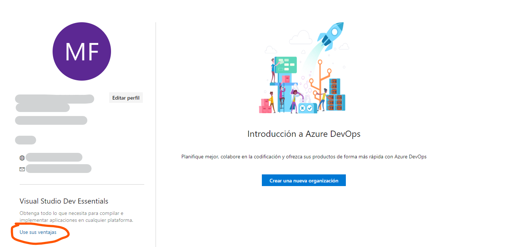
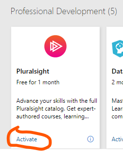

# Documentación

## Herramientas útiles

- [Visual Studio Code](https://code.visualstudio.com/). Es el mejor editor de código y el más usado en el mundo. Cuando abres un programa escrito en JavaScript por poner un ejemplo, el editor le agrega colores para que parezca más genial tu código.

- [.Net Core](https://dotnet.microsoft.com/download/thank-you/dotnet-sdk-2.2.301-windows-x64-installer). Es la plataforma que tiene Microsoft para construir aplicaciones usando el lenguaje de programación C#.

- [Git](https://git-scm.com/download/win). Es el mejor sistema de control de versiones que hay. Fue hecho por Linus Tolvards para evitar tener que tratar con personas en proyectos colaborativos. O sea, esto te sirve para trabajar en equipo y para mantener un registro de los cambios que hagas en tu código.

- [NodeJS](https://nodejs.org/dist/v10.16.0/node-v10.16.0-x64.msi). Esta herramienta permite ejecutar código JavaScript fuera del navegador. 

## Libros, webs y cursos

Las siguientes recomendaciones son para aprender lo básico de programación y lo básico de programación web. A continuación, las referencias:

1. Lee el libro [La esencia de la Lógica](https://clasew.jimdo.com/app/download/6632237854/Omar+Trejos+Buritic%C3%A1+-+La+Esencia+de+la+Logica+de+Programaci%C3%B3n.pdf?t=1377395454). Aquí aprenderás todo lo básico de programación sin un lenguaje de programación.

2. [Curso de programación básica de Platzi](https://platzi.com/programacion). Aquí vas a aprender algunos fundamentos de programación y también aprenderás algo HTML, CSS y JavaScript. Solo es necesario que sigas el curso hasta terminar el tema *Quinto proyecto: Cajero automático*

3. [Curso de HTML y CSS](https://es.khanacademy.org/computing/computer-programming/html-css). Aquí aprenderás lo básico de HTMLy CSS. **Importante**: Solo necesitas ver los videos de los siguientes temas que hay en la página:

    - Introducción a HTML
    - Introducción a CSS
    - Más etiquetas HTML
    - Diseño CSS

4. [Curso de Bootstrap](https://www.youtube.com/watch?v=nug1pMke-y4&list=PLhSj3UTs2_yWTKvu1Aq3xUhzIJNBZ3MFW). Ya teniendo las bases de HTML y CSS, este curso te lleva a un paso más enseñándote el framework de CSS más usdo del mundo en su versión n° 3. Bootstrap sirve para ahorrarte escribir muchas líneas de código CSS.

5. Aplica todos tus conocimientos anteriores en un formulario web usando JSON y el *local storage* del navegador. Debes saber Bootstrap para seguir este curso. Debes copiar el código HTML que ves en su editor en los primeros segundos del video y usar bootstrap en ese proyecto, y ya luego podrás seguir los siguientes minutos del primer video y los demás que restan.

    - [Creación de objeto desde formulario json](https://www.youtube.com/watch?v=Tj2EuBHN5bQ)
    - [Dibujar tabla amigos con información de un JSON](https://www.youtube.com/watch?v=ww99RandZlo)
    - [Guardar y obtener la lista del local storage](https://www.youtube.com/watch?v=XUHYQEJhVzs)

    > Te recomiendo usar Git para este proyecto para que vayas ensayando y también sube tu código a un repositorio remoto en GitHub.

6. [Curso de C# y Programación Orientada a Objetos (POO)](https://app.pluralsight.com/library/courses/csharp-fundamentals-dev/table-of-contents). En este curso aprenderás las bases de C# como lenguaje de programación a la vez que te enseña los pilares de la POO: Herencia, Encapsulación, Polimorfismo y Abstracción. Este curso se encuentra en una plataforma de pago llamada Pluralsight. Puedes obtener una cuenta gratuita por un mes siguiendo estos pasos:

    - Entra a [Visual Studio Dev Essentials](https://visualstudio.microsoft.com/es/dev-essentials/) y regístrate.
    - Inicia sesión ahí.
    - En la página de inicio haz click  en botón que dice "Obtener mis Beneficios". Ejemplo: 
    
    
    - Busca a pluralsight y dale para obtener el cupo.  
    
        
    
    - Llena el formulario de Pluralsight.
    - Inicia Sesión en [Pluralsight](https://app.pluralsight.com) y accede al curso que señalo arriba. 

5. *(opcional)* [Curso de Git](https://www.youtube.com/watch?v=jSJ8xhKtfP4&list=PLTd5ehIj0goMCnj6V5NdzSIHBgrIXckGU). Git es el sistema de control de versiones más usado. En este curso aprendes buena parte de los comandos principales.

6. *(opcional)* [Aprende Markdown](https://markdown.es/). El formato `.md` indica que dentro del archivo con la extensión hay "markdown" un tipo de lenguaje para escribir hipertexto de manera fácil.
