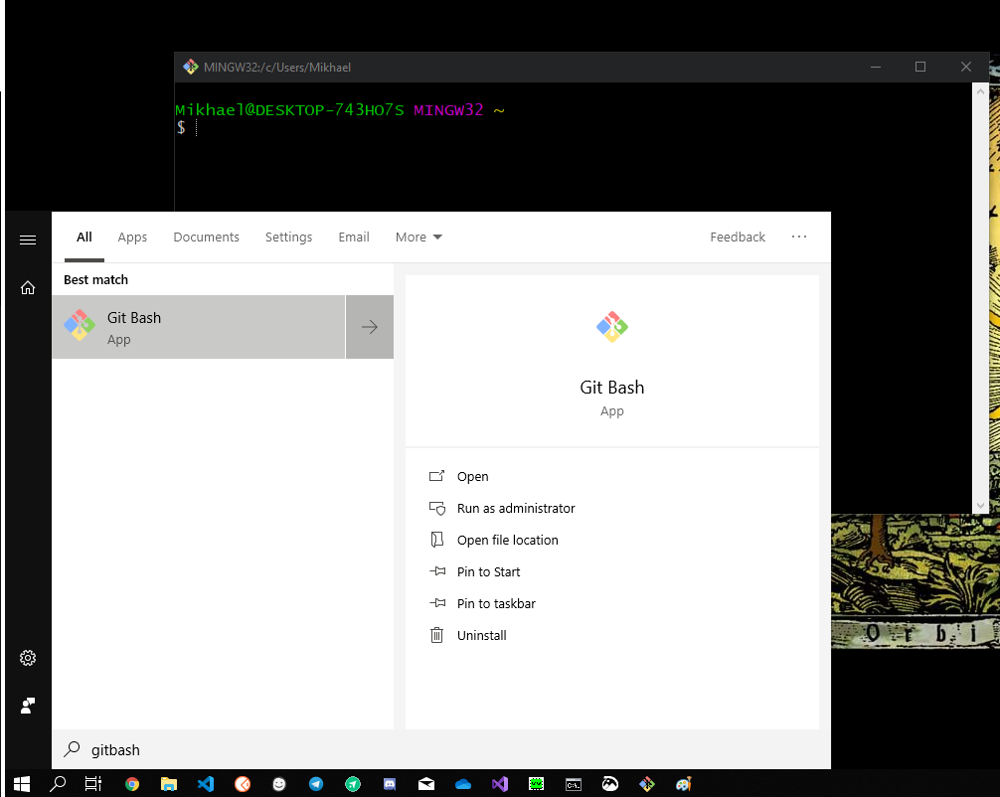
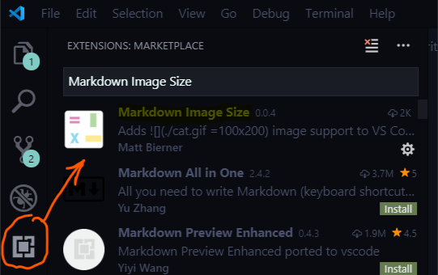
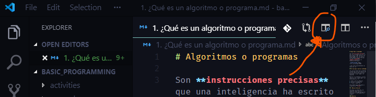

# Notas de programación básica

Aquí encuentras mis notas sobre elementos básicos de programación.

## ¿Cómo descargar el repositorio?

1. [Descarga Git](https://git-scm.com/downloads) e instálalo.
2. Abre la aplicación llamada "Git Bash" (la buscas desde el menú de inicio de Windows".

    

3. Escribe el siguiente comando `git clone https://github.com/Mikhael1729/notas-de-programacion-basica.git`.
4. Presiona "Enter"

¡Listo! Eso va a descargar todo el repositorio.

## ¿Cómo visualizar las notas? (Usando VSCode)

1. [Instala Visual Studio Code](https://code.visualstudio.com/download) e instálalo.
2. Abre VSCode.
3. Vete a la sección de extensiones e instala la extensión "Markdown Image Size".

    

4. Después de haber instalado las extensiones anteriores, ahora abre la carpeta donde descargaste el repositorio yendo a `File -> Open Folder`. ESo abrirá una ventana emergente para que selecciones la carpeta que quieres abrir. Selecciónala y presiona el botón "OK".
5. Abre un archivo cualquiera y presiona luego el botón de previsualización. En la imagen a continuación muestro cuál es el botón:

    

¡Listo!
