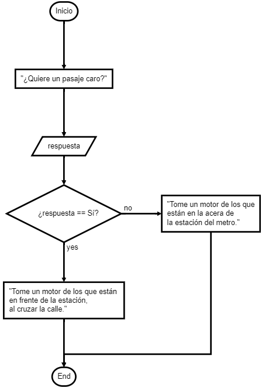

# Algoritmos o programas

Son **instrucciones precisas** que una inteligencia ha escrito para indicar cómo realizar una determinada tarea. En nuestro mundo moderno una persona que escribe ***programas computacionales*** se le denomina programador.


> Gon y Killua aprendiendo las bases del nen

## Sirven para resolver problemas

Las instrucciones de un programa o algoritmo no se escriben si no por otro motivo que solucionar problemas, o sea, cumplir un objetivo.

Resolver un problema no resulta sencillo, por lo que seguir una metodología es útil:

1. Tener claro el objetivo.
2. Escribir el algoritmo.
3. Probar el agoritmo.

Esto asegura que algoritmo se produzca sin **fallas**.

## ¿Cómo escribo uno?

Para hacer un algoritmo solo necesitas tener claro el objetivo o problema que quieres solucionar. A continuación un ejemplo: 

### Objetivo

Indicar cómo llegar a INTEC desde la estación del metro Francisco Gregorio Billini

### Algoritmo

**En seudocódigo:**

```seudo
ALGORITMO Indicar cómo llegar a INTEC desde la estación del metro

VARIABLES
  Booleano: quiere_un_pasaje_barato
  
INICIO
  IMPRIME "¿Quiere un pasaje caro?"
  LEA respuesta
  
  SI respuesta == "Si":
    IMPRIME "Tome un motor de los que están en frente de la estación, al cruzar la calle."
  SINO:
    IMPRIME "Tome un motor de los que están en la acera de la estación del metro."
FIN
```

**En diagrama de flujo:**



### Prueba de escritorio

|Pantalla|Memoria
|--|--|
|¿Quieres un pasaje caro?<br /> "Tome un motor de los que están en frente de la estación, al cruzar la calle." <br />|`respuesta` <br /> Si <br />|

## Estructuras básicas

Las estructuras básicas o elementales de los algoritmos son las siguientes:

- **Variables**. Es un espacio dentro de la RAM o Disco duro que se habilita y permite almacenar y retirar información cuantas veces sea necesario.
- **Constantes**. Son exactamente iguales que las variables con la diferencia que éstas solo se inicializan una sola vez, y no es permitido cambiar su valor.
- **Operadores**. Son símbolos que permiten realizar ciertos cálculos con las variables, como suma (`+`), multiplicación (`x`), resta (`-`) y la división(`/`), etc. 
- **Secuencias**. Son líneas sucesivas de instrucciones.
- **Decisiones**. Son estructuras de bloque que permiten acceder a ciertas instrucciones si se cumple determinada condición. Las más usadas son las sentencias `if` y `else`. 
- **Ciclos**. Estructuras de bloque que indica que las instrucciones dentro se ejecuten hasta que cierta condición se cumpla. Los más usados son el bucle `for` y `while`. 

**Ejemplo de uso de las estructuras básicas:**

```js
// Algoritmo: Imprimir los números del 1 hasta el indicado

const tope = prompt("Escribe el número");

console.log("Imprime los números del 1 al " + tope);

for(var i = 0; i < tope; i++) {
  console.log(i + 1);
}

var numeroActual =  0;
while(numeroActual < tope) {
  numeroActual++;
  console.log(numeroActual);
}
```


## Alcance de las estructuras de bloque 
```js
if(true) {
  let variable1 = "RANDOM VALUE";
  
  // Aquí no existe "variable2"
  while(true) {
    let variable2= "RANDOM VALUE 2";
    
    // Aquí no existe "i", pero sí, 
    // "variable1" y "variable2"
    
    for(let i = 0; i < 10; i++) {
      // Aquí existen las tres:
      console.log(variable1, variable2, i)
    }
  }
}
```
