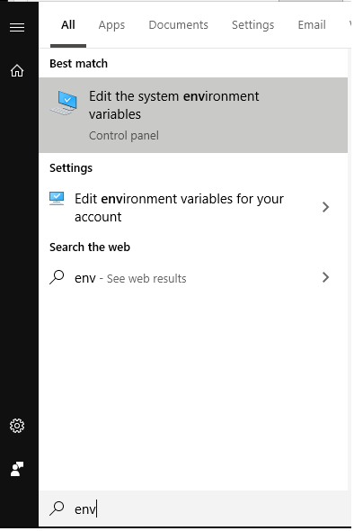
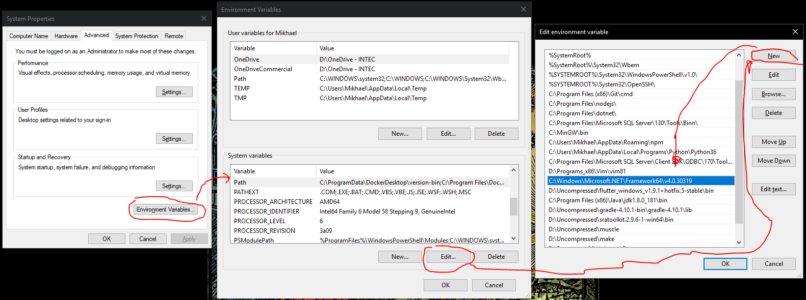
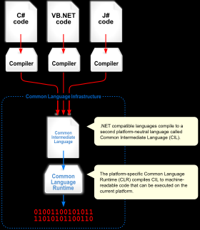

# Hello World C#

C# es un lenguaje de programación multiparadigma, perteneciente a la plataforma .NET de Microsoft, y uno de los más utilizados en todo el mundo. C# toma muchos elementos de C, C++, Java (muy popular en aquel entonces), y ya más recientemente, de JavaScript (como las funciones de flecha).

> Y sí, C# hace refernecia a Do# en música. Como el sostenido aumenta un semitono a la nota alterada, este daba alusión a una superioridad a C++, además de que símbolo `#` hace alusión a 4 símbolos `+`.

**Hello World en C#**:

```c#
class Program
{
  public static void Main()
  {
    System.Console.WriteLine("Hello, World!");
  }
}
```

## Compilados vs Interpretados

La principal diferencia entre lenguajes interpretado y compilados son:

1. Los interpretados hacen la traducción del código fuente al código máquina y lo ejecutan a medida que se lee el código. Los compilados traducen primero todo el código fuente a código máquina y luego se ejecuta el programa.
2. Los lenguajes compilados necesitan un ejecutable para cada ambiente, mientras que los interpretados lo pueden hacer en una gran cantidad de ambientes sin problemas.
3. Los compilados son más lentos por el hecho de ejecutar el código mientras lo van leyendo.


## Compilación

Existen varias maneras en las que puedes compilar y ejecutar código de C#: usando la consola, dotnet, o o la compilación con Visual Studio. Aquí vamos ver las dos primeras.

### Compilar usando Command Line (la consola)

1. Agregar la aplicación de compilación, `csc.exe` a la variable `PATH` de Windows.

    
    

2. Abrir la consola y escribir: `csc` y presionar `Enter`. Esto es par ver si todo se hizo correctamente.
3. Ubicarse en el directorio del archivo a compilar.
4. Escribir `csc <nombre del archivo>` y presionar Enter.
5. Para ejecutar el archivo escribe en la consola el nombre de éste (con la extensión) y presiona Enter.
6. ¡Listo!

### Compilar usando `dotnet`

1. Escribe `dotnet new console <nombre del directorio>`.
2. Escribe `dotnet run` para ejecutar el programa.
3. ¡Listo!

## Así funciona la compilación


